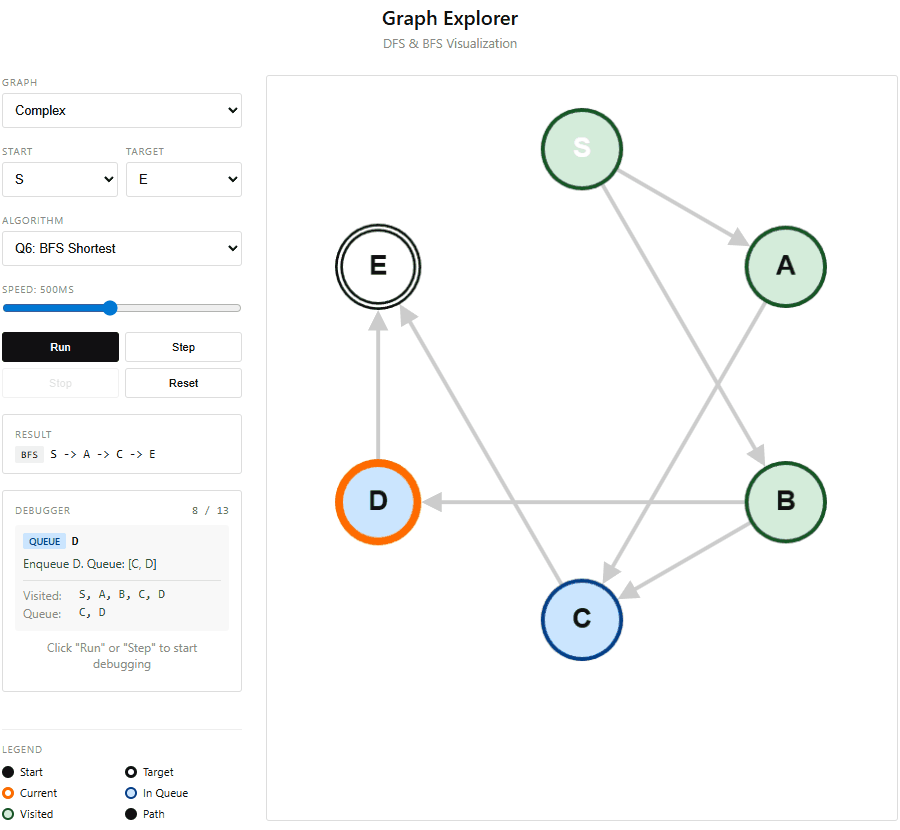

# Functional Programming - Graph Exploration

A TypeScript project made for my studies, exploring graph traversals (DFS/BFS) in a **strictly functional** style.

<div align="center">
   
</div>

## Constraints

- ❌ No loops (`for`, `while`, `forEach`)
- ❌ No `map` / `filter` / `reduce`
- ❌ No mutations (`push`, `pop`, etc.)
- ❌ No `if` / `else` (ternary only)
- ✅ Recursion only
- ✅ Pure functions

## Getting Started

```bash
# Install
npm install

# Run tests
npm test

# Watch mode
npm run test:watch

# Coverage report
npm run test:coverage

# Interactive Demo
npm run demo
```

## Interactive Demo

A Vue.js + Cytoscape.js visualization app to explore the algorithms step-by-step.

**Features:**
- 🎨 5 predefined graphs (Simple, Complex, Disconnected, Tree, Unreachable)
- 🔄 DFS and BFS visualization
- ⏯️ Play/Pause animation with speed control
- 🐛 Step-by-step debugger (forward/backward navigation)
- 🎯 Color-coded node states:
  - 🟢 Green = Visited
  - 🔵 Blue = In Queue (BFS)
  - 🟠 Orange border = Currently processing
  - ⬛ Black = Final path

```bash
npm run demo
# Opens at http://localhost:3000
```

## Structure

| Question | File | Description |
|----------|------|-------------|
| Q1 | `src/list-utils.ts` | Functional list utilities |
| Q2 | `src/visited.ts` | Visited nodes management (cycles) |
| Q3 | `src/dfs.ts` | DFS reachability |
| Q4 | `src/parent.ts` | Parent map + path reconstruction |
| Q5 | `src/dfs.ts` | Find a path with DFS |
| Q6 | `src/bfs.ts` | Shortest path with BFS |

## Tests

128 tests with 100% coverage. Tests verify both correctness **AND** functional constraints compliance (no loops, no if/else, etc.).

```bash
npm test
```
